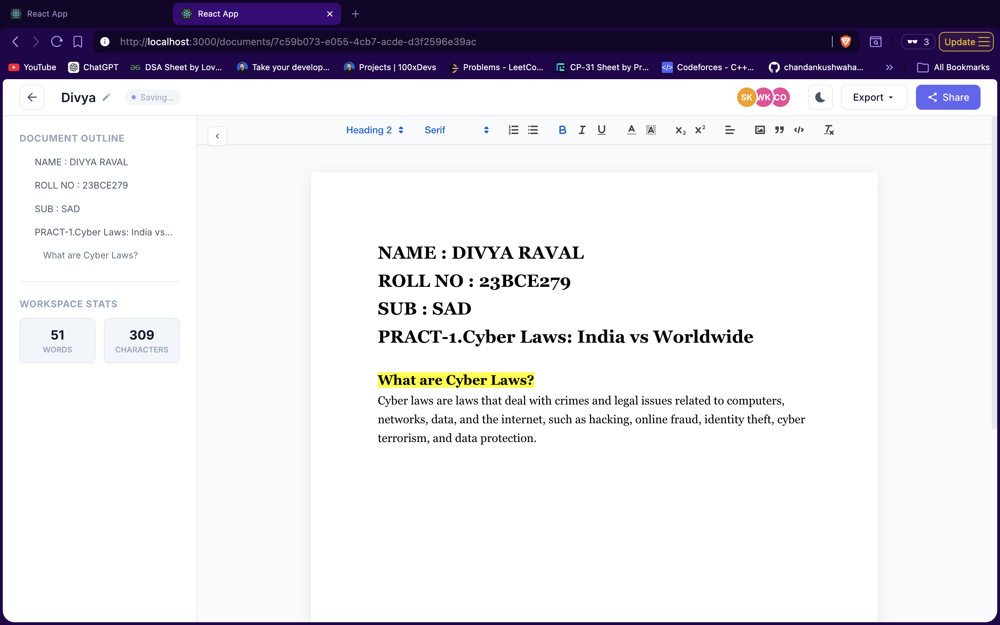

# DivDocs — Collaborative Real-Time Document Workspace

DivDocs is a premium, real-time collaborative document editor and workspace (similar to Google Docs) built using **React (v19)**, **Node.js**, **Socket.IO**, and **MongoDB**. It enables users to create notes, edit documents concurrently with active collaboration indicators, organize content with auto-generated outlines, and export files to multiple formats under both light and dark mode themes.

---

## 

### 1. Document Dashboard (Dark Mode)


### 2. Rich Text Collaborative Editor (Light Mode)



---

## Features

- **Interactive Document Dashboard**: 
  - Real-time MongoDB document indexing.
  - Instant title search filter.
  - Inline renaming and document deletion actions.
  - One-click copyable sharing links.
  
- **Rich Collaborative Editor**:
  - Page-centered Georgia typography page format.
  - Live Saving / Autosave indicator.
  
- **Active Collaboration Presence**:
  - Tracks other users editing the same document in real time.
  - Displays overlapping colored user initials with anonymous handles (e.g. `"Vibrant Cheetah"`).
  
- **Collapsible Workspace Sidebar**:
  - **Interactive Document Outline**: Auto-scrapes and compiles document headers (`H1`, `H2`, `H3`, `H4`) into a hierarchical list. Clicking on an outline item smoothly scrolls the document to that header.
  - **Workspace Statistics**: Real-time word count and character count indicators.
  
- **Multi-Format Document Exports**:
  - Print / Export to **PDF** (using custom media print stylesheet rules).
  - Download as **Markdown (.md)**, **HTML (.html)**, or **Plain Text (.txt)**.
  
- **Seamless Dark & Light Mode Toggling**:
  - System-wide CSS variables for smooth theme transitions.
  - Theme state persists in local storage across sessions.

---

## Tech Stack

- **Frontend**:
  - React 19
  - React Router v7
  - Quill v2 (Rich text editor)
  - Socket.IO Client (WebSockets)
  - Vanilla CSS Variables

- **Backend**:
  - Node.js & Express
  - Socket.IO (Real-time web sockets)
  - Mongoose & MongoDB (Local / Atlas Cloud storage)

---

## Setup & Installation

### Prerequisites
- [Node.js](https://nodejs.org/) (v16+)
- [MongoDB](https://www.mongodb.com/try/download/community) (Local instance running on port `27017` or Atlas Cloud account)

---

### 1. Backend Server Setup

1. Navigate to the server folder:
   ```bash
   cd server
   ```
2. Install dependencies:
   ```bash
   npm install
   ```
3. Configure the environment variables. Open or create `.env` and set your MongoDB connection string (pointing to your local MongoDB):
   ```env
   MONGO_URI=mongodb://localhost:27017/divdocs
   ```
4. Start the server (runs on port `3001`):
   ```bash
   npm start
   ```

*(If you need to start MongoDB locally on your Mac, run: `mongod --dbpath <data_folder_path> --port 27017 --fork --logpath <log_path>`)*

---

### 2. Frontend Client Setup

1. Navigate to the client folder:
   ```bash
   cd ../client
   ```
2. Install dependencies:
   ```bash
   npm install
   ```
3. Start the development server (runs on port `3000`):
   ```bash
   npm run dev
   ```
4. Open [http://localhost:3000](http://localhost:3000) in your browser!
